<h1>Amplitude Modulation</h1>

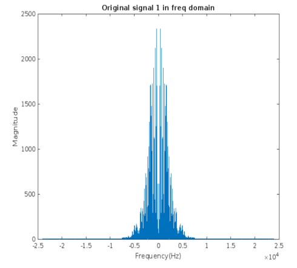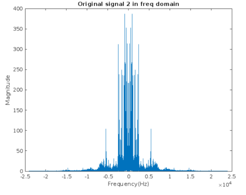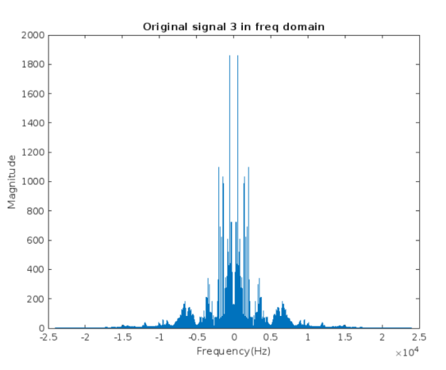

<h2>Modulation</h2>
Perform modulation by multiplying the signals using these carriers:

`Carrier1 = cos ( 2*pi*fc1*t1) where fc1 = 160,000 Hz`

`Carrier2 = cos ( 2*pi*fc2*t2) where fc2 = 320,000 Hz`

`Carrier3 = sin ( 2*pi*fc2*t3) where fc2 = 320,000 Hz`

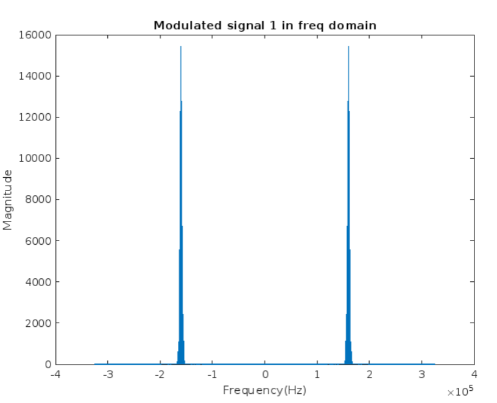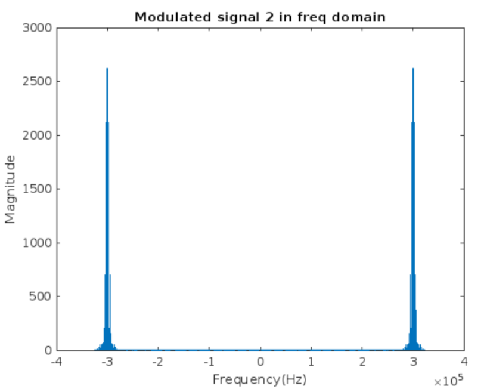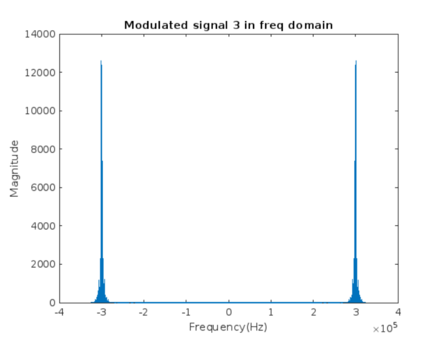

<h2>Required signal</h2>

`s(t)=x1 cos(𝜔1*t) + x2 cos(𝜔2*t) + x3 sin(𝜔2*t)`

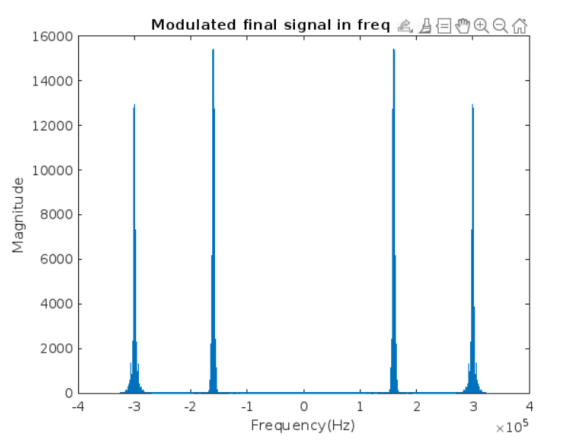

<h2>Demodulation</h2>
Perform <b>synchronous demodulation</b> to s(t) to restore the 3 signals.

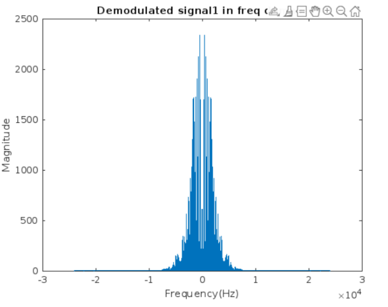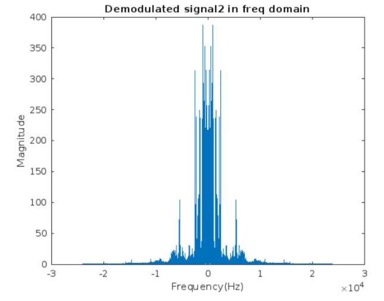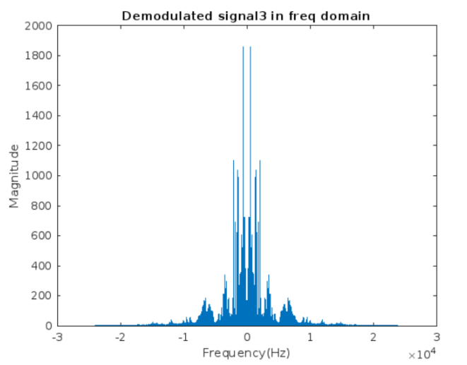

Perform demodulation with <b>phase shift</b> 10, 30, 90 degrees.

`Carrier1 = cos ( 2*pi*fc1*t1 + (phase_shift_angle* pi) / 180 )`

`Carrier2 = cos ( 2*pi*fc2*t2 + (phase_shift_angle* pi) / 180 )`

`Carrier3 = sin ( 2*pi*fc2*t3 + (phase_shift_angle* pi) / 180 )`

In phase shift 10:
Signal 1: there is very little attenuation in it ( the sound is slightly lower).
Signal 2 & 3: there is very little interference between them, but the signal with the current
corresponding carrier is the one with the higher sound.

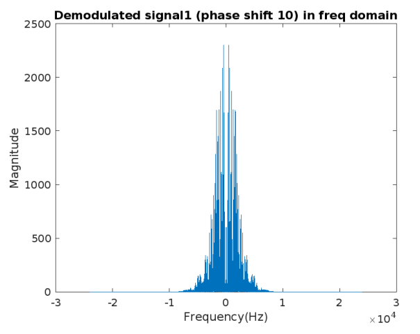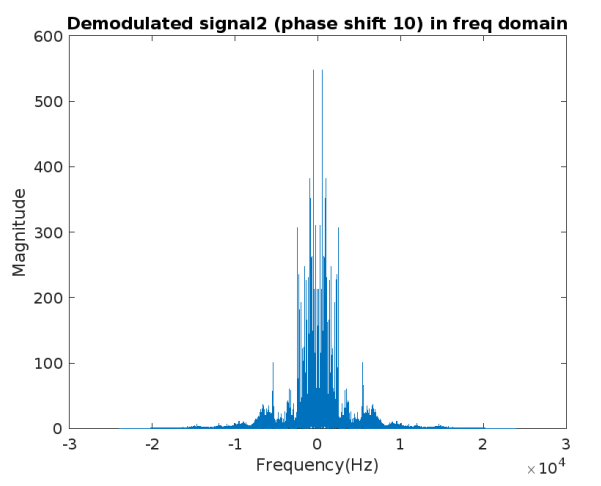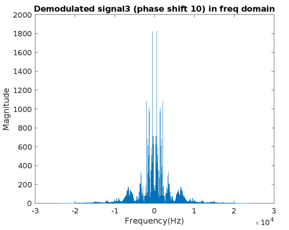

In phase shift 30:
Signal 1: there is more attenuation in it ( the sound is lower than the previous case).
Signal 2 & 3: there is more interference between them, and the signal with the current
corresponding carrier is still a little bit with higher sound.

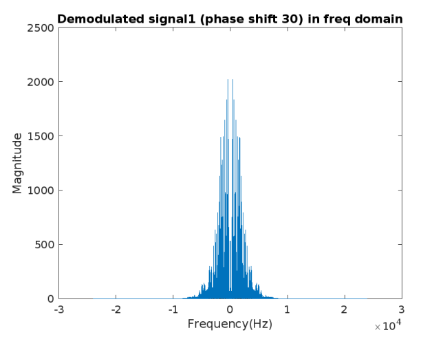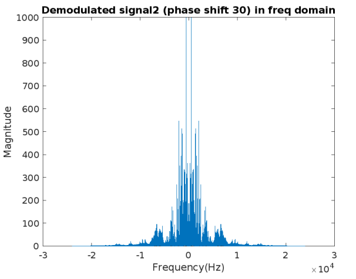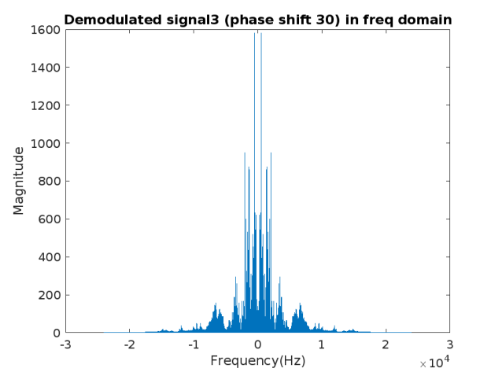

In phase shift 90:
Signal 1: it is completely attenuated ( there is no sound).
Signal 2 & 3: there is complete interference between them, the signals are interchanged with
each other ( when we try to get signal 2, we get signal 3 and vice versa).

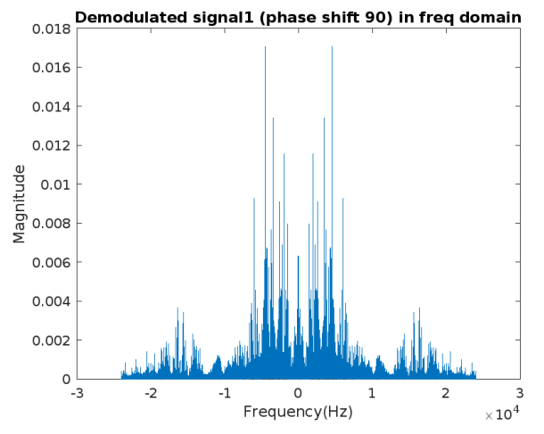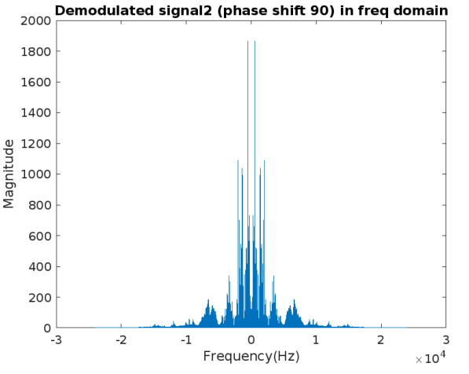

Perform demodulation with a local carrier frequency that is different by 2 Hz and 10 Hz from its carrier frequency (<b>frequency shift</b>).

`Carrier1 = cos ( 2*pi*(fc1+2)*t1 )`

`Carrier1 = cos ( 2*pi*(fc1+10)*t1 )`

Different by 2Hz:
There is little attenuation and distortion in the output signal.

Different by 10Hz:
There is more attenuation and distortion in the output signal than the previous case.

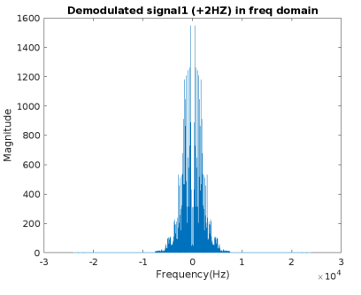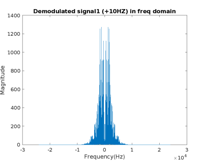
